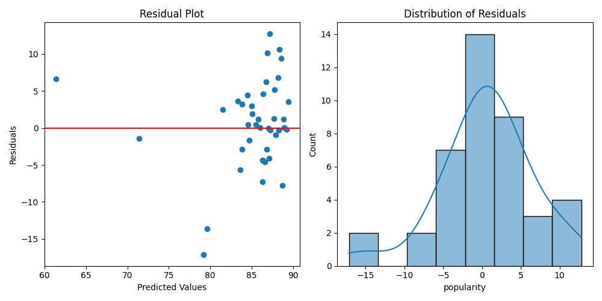

<h1 align="center">Music Forecast</h1>

MusicForecast is a `machine learning` project designed to predict the popularity of songs based on their attributes, such as tempo, duration, genre and release year. The project uses a dataset of real-world songs and applies various machine learning techniques to train a predictive model.

## ⚡ Features

- **Dataset Generation**: A dataset of songs is created with attributes like artist, title, genre, tempo, duration and popularity.
- **Data Preprocessing**: Includes handling missing values, feature engineering (one-hot encoding genres, creating decade-based features), and scaling numerical features.
- **Model Training**: Compares multiple machine learning models (Linear Regression, Random Forest, SVR) to find the best-performing model.
- **Hyperparameter Tuning**: Optimizes the model using GridSearchCV.
- **Visualization**: Generates visualizations for data distribution, feature importance, correlation matrix, learning curves and residual analysis.
- **Prediction**: Provides a function to predict the popularity of new songs based on their attributes.

## 📂 Directory Structure

> [!NOTE]
> - ├── dataframe.py
> - ├── music_dataset.csv
> - ├── model-training.py
> - ├── music_model.pkl
> - ├── scaler.pkl
> - ├── feature_names.pkl 
> - ├── predict.py

## 📊 Visualizations

### - Correlation Matrix:
Shows the correlation coefficients between numerical features. Highlights relationships between features, helping to identify multicollinearity or key predictors of popularity.

### - Feature Importance:
A bar plot of the top 15 features ranked by their coefficients (for linear models) or importance scores (for tree-based models). Highlights the most influential features in the model.

### - Learning Curve:
A line plot showing the training and cross-validation R² scores as the training size increases. Evaluates the model's learning behavior, helping to detect underfitting or overfitting.

### - Popularity distribution:
A histogram showing the distribution of song popularity scores in the dataset. Helps visualize how popularity values are spread, identify patterns and detect outliers or imbalances.

<table><tr><td>
      <h3 align="center">Heatmap of feature correlations matrix</h3>
      
    </td><td>
      <h3 align="center">Bar plot of feature importance </h3>
        </td>
  </tr>
    <tr><td>
      <h3 align="center">Learning curve of the best model </h3>
      
    </td><td>
      <h3 align="center">Popularity distribution </h3>
      
    </td></tr>
</table>

### - Residual Analysis:
Residual Plot: A scatter plot of predicted values vs. residuals, with a horizontal line at zero.
Residual Distribution: A histogram with a kernel density estimate (KDE) showing the distribution of residuals.
Evaluates the model's prediction errors, checking for patterns or biases in residuals.



----

## 📦 Installation and Setup

### Clone the repository

    git clone https://github.com/karmaniket/MusicForecast.git
    cd MusicForecast

### Create & Activate virtual environment

    python -m venv venv
    
    # Windows
    venv\Scripts\activate.bat  
    
    # Mac
    source venv/bin/activate    

> [!IMPORTANT]
> - Python 3.8 - 3.12
> - Required libraries: `pandas`, `numpy`, `matplotlib`, `seaborn`, `scikit-learn`

### Install dependencies

    pip freeze > requirements.txt
    pip install -r requirements.txt

## </> Running the Project

#### Run `dataframe.py` to generate the `.csv` file:

        python dataframe.py

#### Run `model-training.py` to train the `model`, generate `visualizations` and `.pkl` files:

        python model-training.py

#### Run `predict.py` to predict the popularity of new song:

        python predict.py

- To predict the popularity of a new song, modify the `example_song` dictionary in `predict.py` with the song's attributes:

```python
predict_pplrt = {
    'tempo': 120,
    'duration': 180,
    'year': 2030,
    'genre': 'pop'
}
```

### Data Splitting

> [!Note]
> The training and testing split can be configured prior to creating the `.pkl` files.
This project uses `80:20 train_test_split` ratio, with consistent results due to the fixed `random_state`.

    X_train, X_test, y_train, y_test = train_test_split(X, y, test_size=0.2, random_state=42)

## 🌟 Results & Future Improvements

- The best-performing model is selected based on metrics like R², MAE, MSE, and RMSE.
- Hyperparameter tuning ensures optimal model performance.
- Visualizations provide insights into the dataset and model behavior.
- Add more features to improve prediction accuracy.
- Experiment with additional machine learning algorithms.
- Incorporate deep learning models for better performance.

## ©️ License
This project is licensed under the MIT License. Feel free to use, modify and distribute with attribution.# MusicForecast
